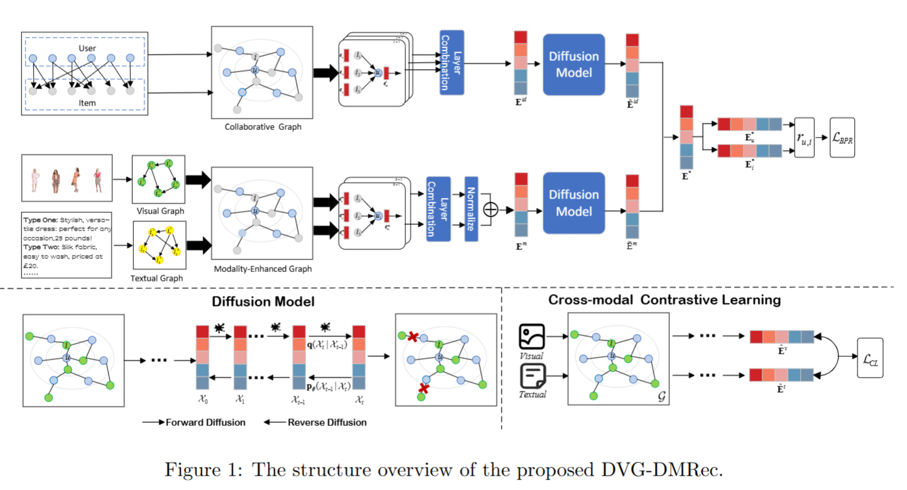
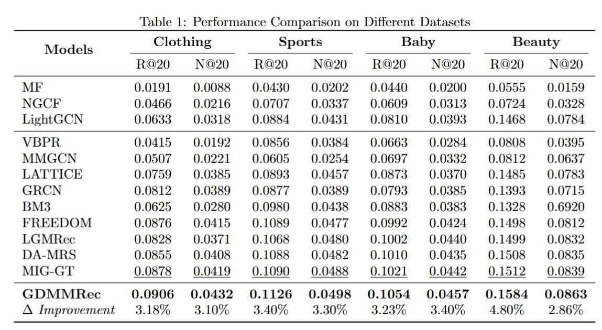
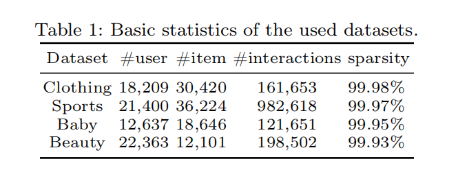

# DVG-DMRec: Dual-View Graph-Conditioned Diffusion for Multimodal Recommendation

This is the PyTorch implementation for **DVG-DMRec** proposed in the paper **Dual-View Graph-Conditioned Diffusion for Multimodal Recommendation**. 

In this paper, we propose a novel Dual-View Graph-Conditioned Diffusion for Multimodal Recommendation (DVG-DMRec), which seamlessly integrates local embedding graphs and diffusion models to mitigate sparsity and noise issues. Firstly, the local embedding graphs (LGE) are embedded into user ID embeddings and modality information separately, enabling independent learning of collaborative-related and modality-related item representations, thus effectively integrating multi-modal features. Additionally, the introduction of the diffusion model combines local graphs with diffusion models, efficiently addressing the sparsity and noise problems arising from the mixed propagation of intra-graph modality and behavioral features.

## 📝 Environment

We develop our codes in the following environment:

- python==3.9.13
- numpy==1.23.1
- torch==1.11.0
- scipy==1.9.1

## 🎯 Experimental Results

Performance comparison of baselines on different datasets in terms of Recall@20 and NDCG@20:

## 📚 Datasets

